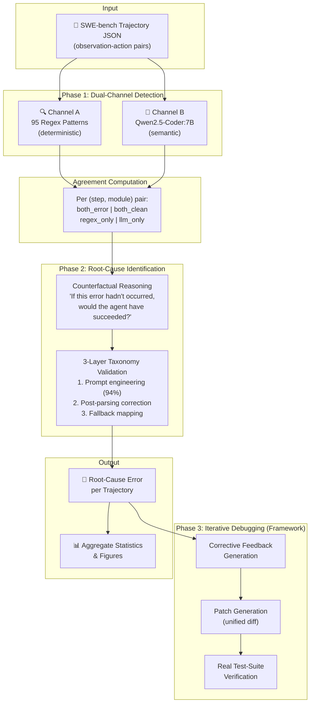
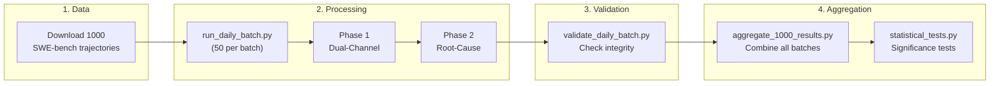
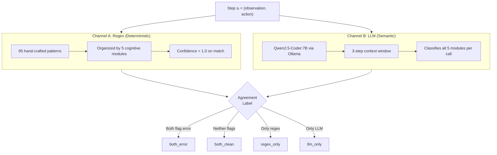
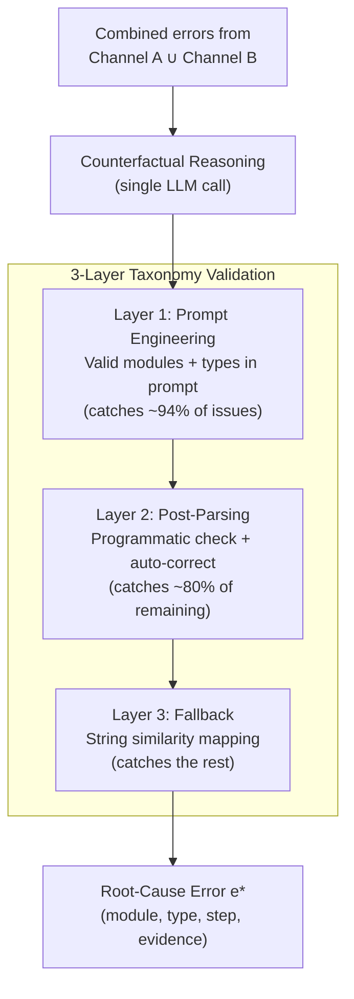
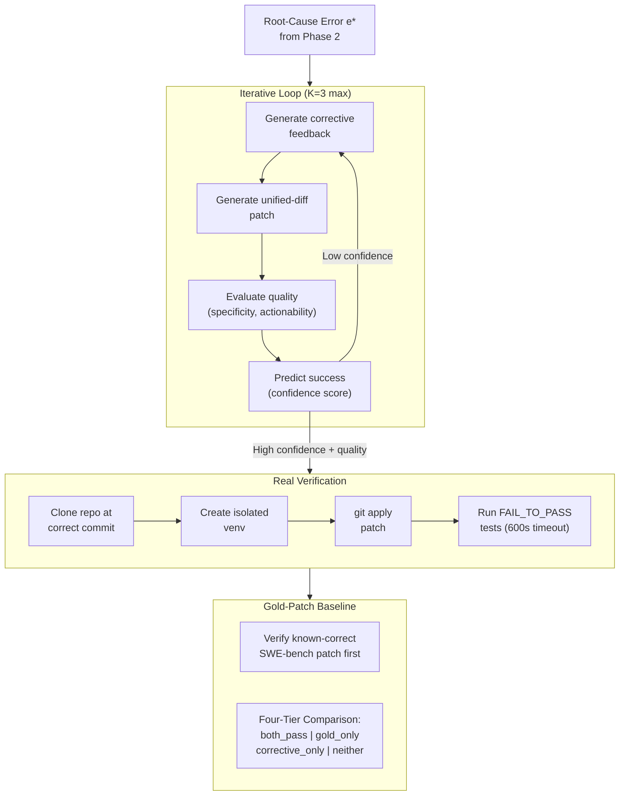
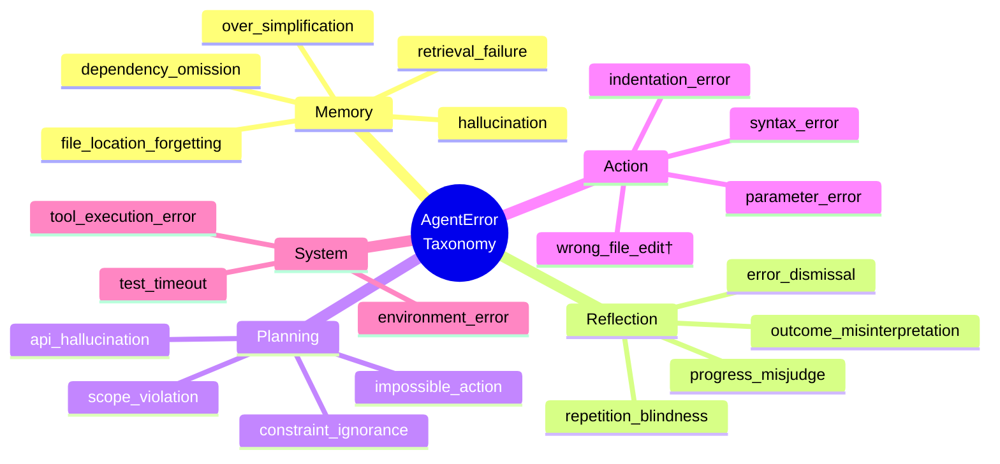
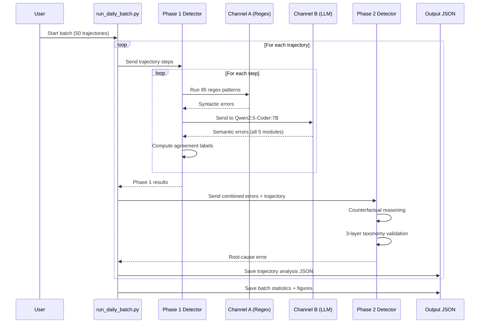

# AgentDebug: Dual-Channel Error Detection and Root-Cause Diagnosis for LLM Agents

[](https://www.python.org/downloads/)
[](LICENSE)
[](https://ollama.ai)
[](https://www.swebench.com/)

> **Paper:** *AgentDebug: Dual-Channel Error Detection and Root-Cause Diagnosis for LLM Agents on Software Engineering Tasks* (IEEE Access, 2026)

AgentDebug is a framework for **detecting**, **diagnosing**, and **categorizing** errors in LLM coding-agent trajectories. It runs two independent detection channels — 95 hand-crafted regex patterns and a locally hosted LLM — over every step of an agent trajectory, then applies counterfactual reasoning to pinpoint root causes. The entire pipeline runs on consumer hardware at **$0.00 API cost**.

---

## Key Results (300 SWE-bench Trajectories)

| Metric | Value |
|--------|-------|
| Trajectories analyzed | 300 |
| Total steps processed | 8,524 |
| Module-level comparisons | 42,620 |
| Regex errors detected | 1,662 |
| LLM errors detected | 13,616 |
| Detection multiplier (LLM / Regex) | **8.2×** |
| Module-level agreement rate | **69.1%** |
| Root causes identified | 293 / 300 |
| Total API cost | **$0.00** |
| Total inference time | ~70.8 hours |

### Key Findings

- **Module-level asymmetry:** Regex over-represents Action + System errors (62.4%) while under-detecting cognitive failures; the LLM channel captures Memory, Reflection, and Planning errors at 58.7%
- **Frequency ≠ Criticality:** Rare System errors cause 2.0× more root-cause failures than their frequency predicts, while common Action errors are less likely to be the actual root cause
- **Complementary channels:** The two channels agree 69.1% of the time at the module level but characterize errors at different abstraction levels — regex sees syntactic symptoms, the LLM names semantic causes

---

## Architecture Overview



---

## Pipeline Execution Flow



---

## Phase 1: Dual-Channel Detection

Every trajectory step passes through two independent channels simultaneously:



### Regex Pattern Distribution (95 patterns)

| Module | Patterns | Target Error Types |
|--------|----------|--------------------|
| **Action** | 28 | `syntax_error`, `indentation_error`, `parameter_error` |
| **Planning** | 22 | `api_hallucination`, `scope_violation`, `constraint_ignorance` |
| **Memory** | 18 | `dependency_omission`, `hallucination`, `retrieval_failure` |
| **Reflection** | 15 | `error_dismissal`, `repetition_blindness`, `outcome_misinterpretation` |
| **System** | 12 | `tool_execution_error`, `environment_error`, `test_timeout` |

---

## Phase 2: Root-Cause Identification



---

## Phase 3: Iterative Debugging with Real Verification (Framework)

Phase 3 closes the loop from detection to repair. Given the root-cause error from Phase 2:



---

## Error Taxonomy

5 cognitive modules, 20 error types (19 predefined + 1 emergent):



> † `wrong_file_edit` is an **emergent type** — not part of the original taxonomy, discovered by the LLM channel during analysis.

---

## Project Structure

```
AgentDebug/
├── detector/                              # Core detection engine
│   ├── code_error_taxonomy.py             # 20 error types across 5 cognitive modules
│   ├── automatic_error_detection.py       # Channel A: 95-pattern regex engine
│   ├── code_phase1_detector.py            # Phase 1: Dual-channel orchestrator
│   ├── code_phase2_detector.py            # Phase 2: Counterfactual root-cause ID
│   ├── code_phase3_debugger.py            # Phase 3: Iterative debugging framework
│   ├── patch_verifier.py                  # Real test-suite verification
│   └── swebench_integration.py            # SWE-bench trajectory loader & parser
│
├── experiments/
│   └── run_code_experiments.py            # Experiment orchestrator (Phase 1 + 2)
│
├── analysis/
│   ├── __init__.py
│   └── cross_domain_analysis.py           # Cross-domain comparison utilities
│
├── paper/
│   ├── agentdebug_paper.tex               # Full paper (IEEE Access format)
│   ├── extract_paper_values.py            # Extract statistics for paper tables
│   └── figures/                           # Generated visualizations
│       ├── error_distribution_code.png
│       ├── top_error_types.png
│       └── critical_errors_analysis.png
│
├── scripts/
│   └── download_swebench_metadata.py      # Download SWE-bench instance metadata
│
├── data/
│   └── swebench/
│       └── final_trajectories/            # 1000 trajectory JSONs (not in repo)
│
├── run_complete_pipeline.py               # Master pipeline with resume logic
├── run_daily_batch.py                     # Batch processing (50 trajectories/batch)
├── validate_daily_batch.py                # Post-batch validation checks
├── aggregate_1000_results.py              # Cross-batch result aggregation
├── statistical_tests.py                   # Statistical significance tests
├── error_outcome_analysis.py              # Error-outcome correlation analysis
├── analyze_cross_model_comparison.py      # Cross-model comparison
├── analyze_error_outcome_correlation.py   # Error-outcome deep dive
├── check_study_readiness.py               # Pre-run environment verification
├── validation_sample_100.py               # Manual validation sampling
│
├── requirements.txt
├── .env.example
├── .gitignore
└── README.md
```

---

## Getting Started

### Prerequisites

- **Python 3.9+**
- **[Ollama](https://ollama.ai)** installed and running
- **~5 GB disk space** for the Qwen2.5-Coder:7B model
- **16 GB RAM** recommended

### Installation

```bash
# Clone the repository
git clone https://github.com/Amitanand0123/major_project.git
cd major_project

# Install Python dependencies
pip install -r requirements.txt

# Pull the LLM model
ollama pull qwen2.5-coder:7b
```

### Download Trajectory Data

The SWE-bench trajectory data is sourced from the [Nebius SWE-agent trajectories](https://huggingface.co/datasets/nebius/SWE-agent-trajectories) dataset on HuggingFace.

```bash
python scripts/download_swebench_metadata.py
```

This places 1,000 JSON trajectory files into `data/swebench/final_trajectories/`.

### Configure Environment

```bash
# Copy the example environment file
cp .env.example .env

# Edit .env if using API providers (optional)
# Default Ollama setup requires NO API keys
```

---

## Usage

### Run a Single Batch (50 Trajectories)

```bash
python run_daily_batch.py \
  --trajectory-dir data/swebench/final_trajectories \
  --provider ollama \
  --base-dir results_1000_study
```

Progress is tracked automatically in `results_1000_study/progress.json`.

### Run the Complete Pipeline

```bash
python run_complete_pipeline.py \
  --trajectory-dir data/swebench/final_trajectories \
  --provider ollama \
  --max-trajectories 10
```

### Validate a Completed Batch

```bash
python validate_daily_batch.py --batch 1
```

### Aggregate Results Across All Batches

```bash
python aggregate_1000_results.py
```

### Run Statistical Tests

```bash
python statistical_tests.py
```

---

## How It Works — Step by Step



---

## Supported LLM Providers

| Provider | Model | Cost | Setup |
|----------|-------|------|-------|
| **Ollama** (default) | Qwen2.5-Coder:7B | Free | `ollama pull qwen2.5-coder:7b` |
| Groq | LLaMA-based models | Free tier | Set `GROQ_API_KEY` in `.env` |
| OpenAI | GPT models | Paid | Set `OPENAI_API_KEY` in `.env` |
| Anthropic | Claude models | Paid | Set `ANTHROPIC_API_KEY` in `.env` |

---

## Computing Environment

All experiments in the paper ran on:

| Component | Specification |
|-----------|---------------|
| **OS** | Windows 11 Home |
| **RAM** | 16 GB |
| **LLM** | Qwen2.5-Coder:7B (4.7 GB quantized) via Ollama |
| **Processing** | 6 batches × 50 trajectories |
| **Total inference time** | ~70.8 hours (~14.2 min/trajectory) |
| **LLM calls** | ~8,800 |
| **Timeout rate** | < 0.3% |
| **API cost** | $0.00 |

---

## Research Questions

| RQ | Question | Key Finding |
|----|----------|-------------|
| **RQ1** | What error types and frequencies do LLM agents exhibit? | LLM detects 8.2× more errors; Action errors dominate regex (53.1%) while LLM captures more cognitive errors |
| **RQ2** | How do the two detection channels agree? | 69.1% module-level agreement; channels characterize errors at different abstraction levels |
| **RQ3** | Which errors actually cause failures? | Frequency ≠ criticality; rare System errors are 2.0× more likely to be root causes |
| **RQ4** | What changes would reduce agent failures? | Syntax pre-validation + scope-aware editing would address >60% of detected errors |

---

## Citation

```bibtex
@article{anand2026agentdebug,
  title   = {AgentDebug: Dual-Channel Error Detection and Root-Cause Diagnosis
             for LLM Agents on Software Engineering Tasks},
  author  = {Anand, Amit and Aggarwal, Yash and Kumar, Krishn Kant and Kachhava, Rajendra},
  journal = {IEEE Access},
  year    = {2026},
  publisher = {IEEE}
}
```

---

## Authors

- **Amit Anand** — Indian Institute of Information Technology, Kota
- **Yash Aggarwal** — Indian Institute of Information Technology, Kota
- **Krishn Kant Kumar** — Indian Institute of Information Technology, Kota
- **Rajendra Kachhava** (Advisor) — Indian Institute of Information Technology, Kota

---

## License

This project is licensed under the MIT License.
